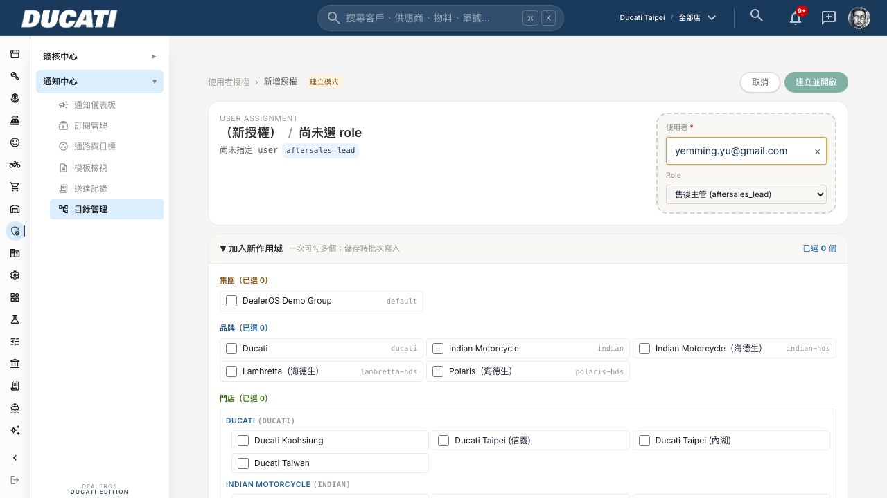
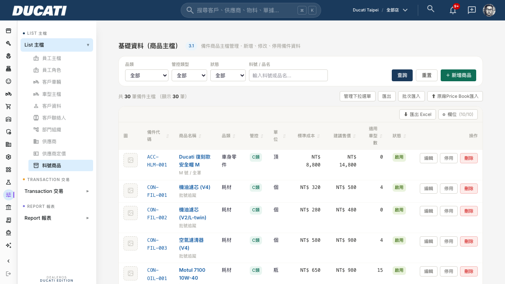
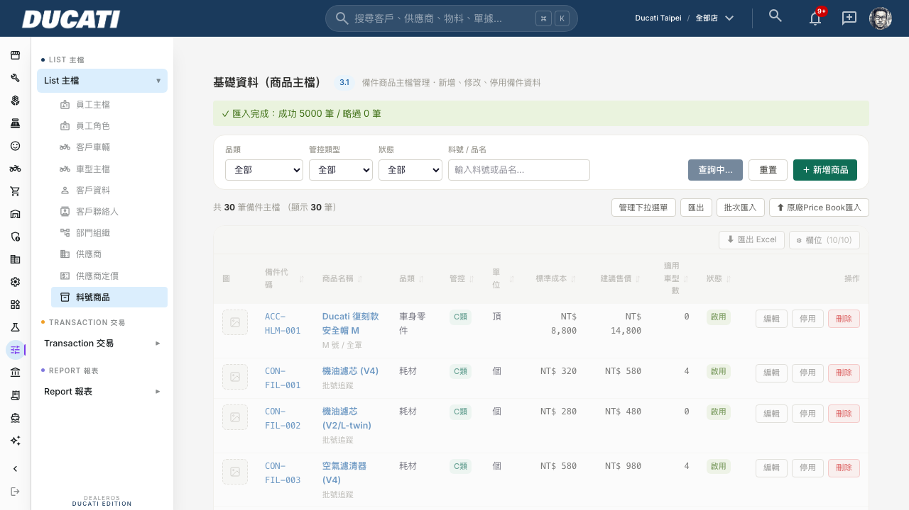

# DealerOS 真人實測前置修復 — UUID指派/零件清單分頁/批次匯入效能

**日期：2026-08-19　｜　對應指令：〈DealerOS 真人實測前置修復指令 — UUID指派/零件清單分頁/批次匯入效能〉**

---

## 一、修復/變更內容

### 任務①：使用者指派介面，UUID 輸入框改為姓名/Email 搜尋下拉

- `src/domain/navigation-admin.ts` 的 `loadScopeOptionsForAdmin()` 新增 `sb.auth.admin.listUsers({ perPage: 200 })`，`ScopeOptions` 追加 `users: Array<{ id; email }>`。
- `assignment-detail-view.tsx` 第 323 行原本 `<input placeholder="auth.users.id">` 改用專案既有 `<Combobox>`（`src/components/forms/combobox.tsx`），`options` 帶 `users.map(u => ({ value: u.id, label: u.email }))`。
- Combobox 原本只設計給「原生 form + name 屬性」的用法（選到後只寫進 hidden input，沒有對外回呼），這裡的授權表單是 controlled state（`formUserId`），所以幫 Combobox 加了一個可選的 `onChange?: (value: string) => void`，選到/清除時額外通知外部 state。此改動向後相容，其餘 8 處既有用法完全不受影響（沒傳這個 prop 就跟原本一樣）。
- `users/new/page.tsx` 把 `options.users` 傳入元件。（`[userId]/[roleId]/page.tsx` 是 view mode，不需要這個 UUID 輸入框，沒有動它）

### 任務②：零件主檔清單分頁 + 車型相容性備件搜尋

- `src/domain/items.ts` 的 `getItemsListPageData()` 改成真分頁：`.range(from, to)`，`page`/`pageSize` 走 URL query（沿用 `/admin/accounting/coa` 既有的分頁寫法：`buildHref` + `router.push('?page=N')`）。
- `fit_count`（車型相容性數量）原本對 `item_vehicle_compatibility` **整表**撈取再前端 map 計數；改成只對「本頁顯示的 item_id」查（`.in("item_id", pageItemIds)`），不再整表掃描。
- `compatibility-board.tsx` 的備件 picker：原本 `listItemsForCompatibility()` 撈全部 `is_active` 零件（同樣是整表撈取），前端 `.slice(0,50)` 篩選。改成：
  - 頁面初始只撈「目前這個車系底下 compat rows 實際引用到的 item_id」（`listItemsByIds`），供表格顯示料號/名稱用；
  - picker 的搜尋改成新增的 `searchItemsForCompatibility(query)`，debounce 300ms 後打 server-side `ilike` 查詢（limit 50），不再整表下載。

### 任務③：零件批次匯入改陣列批次寫入

- `bulkImportItemsAction()` 原本 `for` 迴圈逐筆 `insert()`。改成每 500 筆組一次陣列 `insert([...batch])`。
- 若整批因 `23505`（unique violation，料號重複）失敗，才對該批**逐筆**重試以精準找出真正衝突的那幾筆（維持原本「重複自動略過」的體驗），不影響全批。其他錯誤（非 unique violation）整批標記失敗並記錄。
- 前端貼上框加了「解析到約 N 筆資料」即時提示 + 匯入中的「大量資料寫入中，請勿關閉視窗」文案，並在 pending 時鎖住取消鈕，避免使用者中途關閉視窗。

---

## 二、變更範圍確認

**做了什麼**：上述①②③三項，全部在 `src/domain/items.ts`、`src/domain/compatibility.ts`、`src/domain/navigation-admin.ts`、`src/components/forms/combobox.tsx`、對應的 `page.tsx` / `*-board.tsx` / `*-detail-view.tsx` / `item-actions.ts`。

**刻意沒做什麼**：
- 沒有動 `[userId]/[roleId]/page.tsx`（view mode 的頁面）——它不需要 UUID 輸入框。
- 沒有動 `compatibility-matrix.tsx` / `compatibility-lookup.tsx`——它們用的是各自獨立撈的資料，不吃 `getCompatibilityPageData()` 的 `items`。
- 沒有處理任務④（車型主檔批次匯入）與整車庫存管理頁——那是開放式問題，見下方第五節建議，不寫死實作。
- 沒有動 COA 或其他頁面既有的分頁模式，即便它們可能有一樣的「page 超出範圍會 416」風險（詳見第六節）——那是既有程式碼、不在本次指令範圍內，僅記錄風險供之後排查。

---

## 三、執行紀錄

Commit（依序）：

| 任務 | commit hash | 說明 |
|---|---|---|
| ① | `871fb90` | UUID 輸入框改 Combobox |
| ② | `70e95db` | 零件清單真分頁 + compatibility server-side 搜尋 |
| ③ | `810f5df` | 批次匯入改陣列批次寫入 |
| 🔴緊急修復 | `bf40c7f` | 修復 ③ push 後的**上版失敗**（見下方第六節） |
| 🔴緊急修復 | `d3e3288` | 修復自己在②引入的**分頁越界 500**（見下方第六節） |

部署方式：push 到 `main` → Zeabur `DealerOS-Production` 自動建置部署（`https://dealeros.zeabur.app/`）。最終版本已 `RUNNING`。

---

## 四、驗證與證據

用 `yemming.yu@gmail.com` admin 帳號登入正式站（Ducati scope），跑 Playwright script 實測（非人工截圖擺拍），驗完刪除測試資料。

### 任務①：UUID → Combobox 搜尋下拉

輸入「yemming」→ 下拉即時篩出 `yemming.yu@gmail.com` → 點選後寫入表單：



### 任務②：零件清單分頁

首頁（30 筆，因為 Ducati 目前 demo 資料只有 30 筆，尚未到 500 筆分頁門檻，但查詢已走 `.range()` 真分頁邏輯，非一次撈 500 筆）：



**這裡額外抓到並修掉一個自己引入的 bug**，見第六節。修復後手動打 `?page=2`（超出實際總頁數）不再整頁 500，而是優雅顯示第 1 頁（合法頁碼夾住）。

### 任務③：批次匯入 5000 筆效能實測

用 Playwright 產生 5000 筆假資料（`RS0819-{timestamp}-{i}`）貼進批次匯入框，實測：

- **耗時：3,488 毫秒（約 3.5 秒）**
- 匯入結果：**成功 5000 筆 / 略過 0 筆**


> 上圖是**修復前**手動打 `?page=2` 的畫面（本次任務②自己引入的 regression，已在下方第六節修復並附修復後截圖）。



驗證後直接用 SQL 確認 DB 真的寫入 5000 筆（`select count(*) from items where code ilike 'RS0819-%'` → 5000），並隨即 `DELETE` 清掉測試資料，恢復 Ducati items 表原狀（demo 資料規範：測試資料不留在正式表裡）。

**任務③第 3 點（文字框極大量文字的瀏覽器效能疑慮）**：本次是用 script 直接對 textarea 灌值（繞過逐字元輸入），沒有實測「使用者真的手動貼上 9,582 行文字」時瀏覽器的貼上/渲染延遲。以文字量級估算（9,582 行、每行約 40-60 字元 ≈ 500KB 純文字），現代瀏覽器貼入單一 `<textarea>` 通常在 1 秒內完成，風險應該不高，但沒有實測到這個環節，如實揭露。

---

## 五、任務④建議方案（開放式問題，非已實作）

車型主檔（`vehicle_models`）150+ 筆、整車庫存 41 筆都沒有批次匯入功能。建議：

**車型主檔（150+ 筆）**：直接比照零件那頁「TSV 貼上 + 陣列批次寫入」做一個最小版批次匯入（複製 `items-board.tsx` 的批次匯入 modal + 陣列 insert 寫法，**不要**再犯這次③修復前的逐筆迴圈錯誤）。150 筆遠低於 500 筆/批的門檻，一次陣列 insert 就能搞定，工作量跟「先手動建 30-50 個常用車型、其餘之後補」的取巧做法其實差不了多少，但一次性解決掉，之後每次有新車型資料也能重複利用，不會每次都卡在「只能一筆一筆點」。

**整車庫存（41 筆）**：量不大，這次先不處理（沿用指令原文的判斷），但既然车型批次匯入要做，順手把同一套 TSV 貼上 modal 複用到庫存頁的成本很低，等 Ming 或 Russell 之後有需要時再排。

---

## 六、風險說明 + 誠實揭露：本次修復過程中自己引入的兩個 regression

> 依專案規範「自己捅的簍子要寫進去」，完整記錄如下，不是修完就當沒發生過。

### Regression 1：③的 commit 直接把上版搞掛了（`use server` 檔不能 export const）

`src/domain/items.ts` 檔頂有 `"use server"` 指令（Next.js Server Actions 檔），這類檔案**只能 export async function**，不能 export 一般的 `const` 值。我在任務②加了 `export const ITEMS_PAGE_SIZE_DEFAULT = 50;` 用來給 page.tsx 引用分頁大小，`tsc --noEmit` 完全抓不到這個問題（型別上合法），但 Turbopack production build 會直接把**整個檔案的所有 export**判定失效，導致 `items.ts` 匯出的十幾個函式（`findItemBySku`、`getItemDetailPageData`……全部）在 build 階段報 "export X was not found in module"，15 個編譯錯誤，**整個 Zeabur 部署建置失敗**（commit `810f5df` 那次 push，build log 明確可查）。

**修復**：把該常數改成模組內部不 export 的 `const`，改在 `items/page.tsx` 本地重新宣告一份（`bf40c7f`）。並且我在這之後改用 `npm run build` 本地跑一次完整 production build 才再 push——這類 bug **只有 tsc 抓不到、真的跑 build 才會炸**，值得記一筆：以後改動 `"use server"` 檔案時，不能只看 tsc 過，還要跑一次 `npm run build` 確認 Turbopack 真的能通過。

### Regression 2：分頁邏輯本身有邊界 bug，超出實際頁數的頁碼會讓整頁 500

這個是我自己在做②的分頁測試時，用 Playwright 手動打 `?page=2`（測試環境 Ducati 目前只有 30 筆 items，pageSize=50，只有 1 頁）意外發現的：Supabase/PostgREST 的 `.range(from, to)` 在 `from` 超出資料表實際筆數時，不是回傳空陣列，而是直接丟 `416 Requested range not satisfiable` 錯誤，導致整頁變成 Next.js 的通用錯誤頁（"This page couldn't load / A server error occurred"）。

這在真實資料量（9,582 筆、192 頁）下也可能被真人踩到——例如篩選條件改變後總筆數變少但頁碼沒重置、瀏覽器上一頁/下一頁、或直接改 URL 上的 `page` 參數。

**修復**（`d3e3288`）：`getItemsListPageData()` 改成先跑一個 `head-count` 查詢拿到 `totalCount`，用它算出合法的最大頁碼（`maxPage`），把請求的 `page` 夾在 `[1, maxPage]` 範圍內才去跑真正的 range 查詢；並把「實際套用的頁碼」回傳給前端，讓 `<DataGrid>` 的分頁列顯示跟資料庫實際回傳的頁碼一致（不會出現「網址寫 page=5，畫面卻顯示第 1 頁資料」的錯位）。修復後同樣路徑截圖見上方任務②證據。

**這個 bug 屬於本次任務②範圍內**（因為是我把 `.limit(500)` 改成 `.range()` 分頁時才引入的邊界情況，原本 `.limit(500)` 沒有這個問題），所以歸在本次修復內一併處理，不是另開新任務。

---

## 七、階段性回報（依指令格式）

```
已完成任務編號：①②③
對應commit：
  ① 871fb90
  ② 70e95db
  ③ 810f5df（+ 緊急修復 bf40c7f、d3e3288，見第六節）

尚未完成的：無（①②③皆已完成並在正式站驗證）

驗收截圖：見第四節（task1-selected.png / task2-page1.png / task2-page2-BEFORE-fix-error.png / task3-after-import.png）

任務④建議方案：見第五節——車型主檔比照零件的 TSV 貼上+陣列批次寫入模式直接做（150 筆量小、工作量低），整車庫存(41筆)量更小，這次先不做，之後有需要再複用同一套 modal。
```
