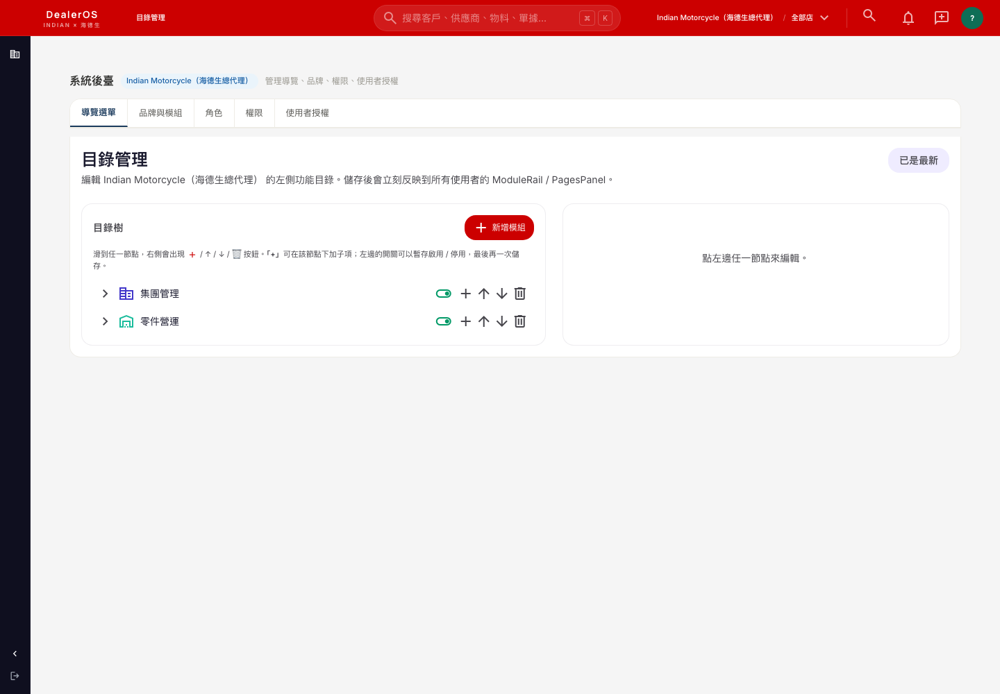
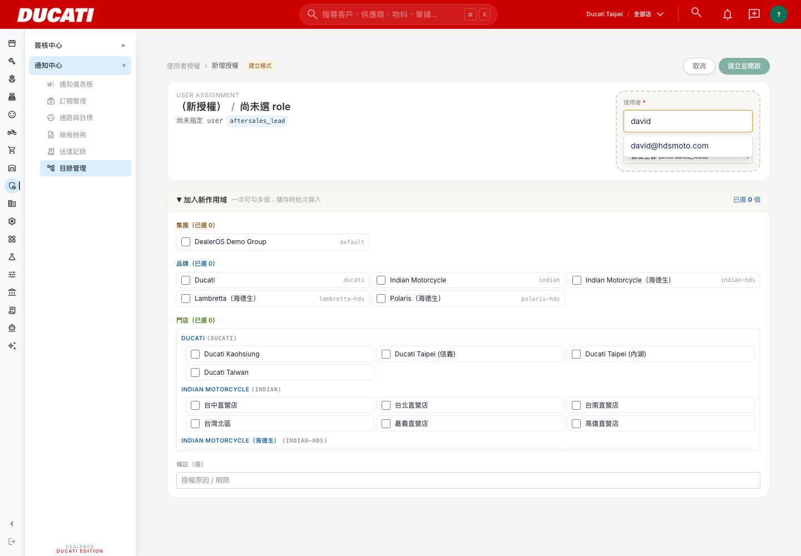
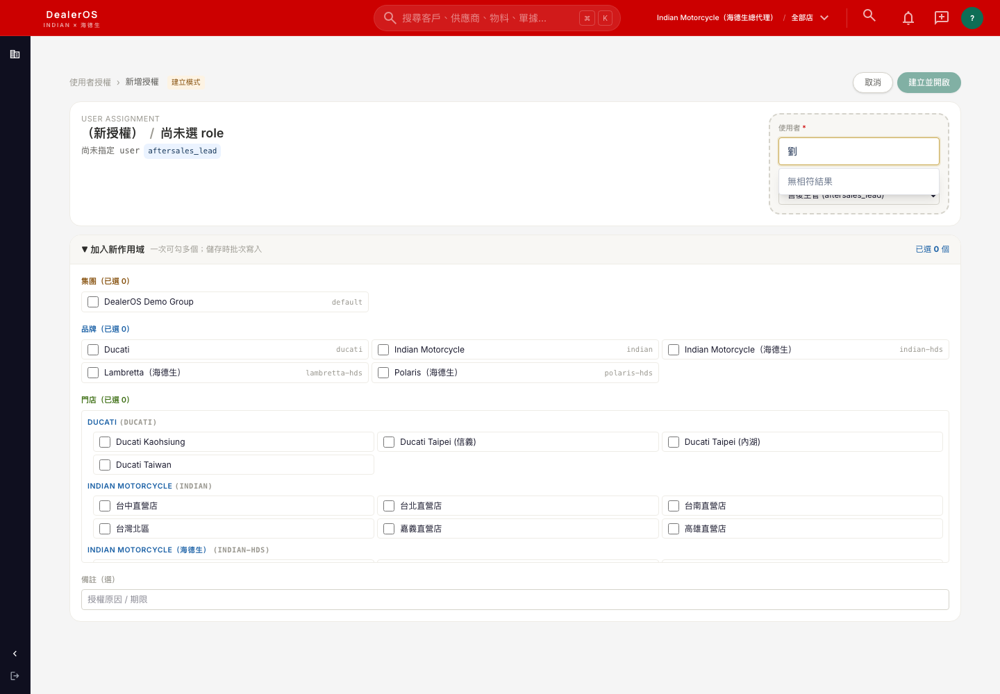
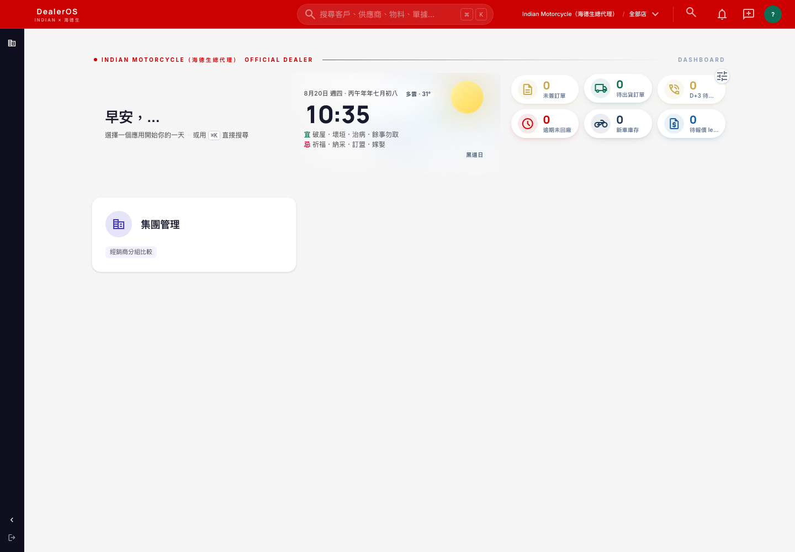
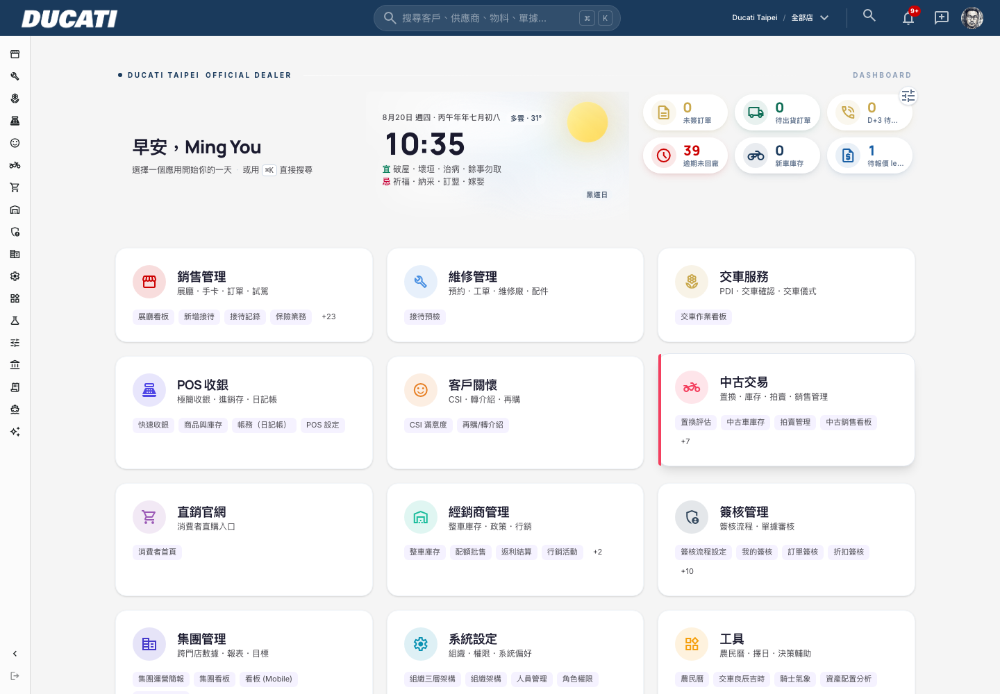

# DealerOS David 權限升級 + 兩項 UI 瑕疵修復 — 完成報告

**日期：2026-08-20　｜　對應指令：《DealerOS David權限升級 + 兩項UI瑕疵修復》（Russell Hung，2026-08-20）**

> 範圍：指令共三項——①②為指定任務，③為確認事項（非必須修復）。①②皆已完成並在正式站驗證；③已查明根因並停下回報，未自行 backfill（理由見第四節）。過程中另外意外發現一個與①驗收標準直接相關的資料落差（姓名搜尋 combobox 實際上搜不到姓名），已如實記錄在第五節，未自行修復。

---

## 一、任務① david@hdsmoto.com 升級為 app_admin

**做法**：`app_admins` 表 insert 一筆，email 走大小寫不分比對，與既有 15 位總代理 `viewer` 角色的 `user_assignments` 完全分開（不衝突）——`isAdmin` 判斷只看 email 是否在 `app_admins`，不影響原本的 brand/store 授權範圍。

```sql
INSERT INTO app_admins (email, granted_by, notes)
VALUES ('david@hdsmoto.com', NULL, '海德生總代理管理員 — 授權自行調整18人角色指派（2026-08-20 Russell 任務文件裁示）')
ON CONFLICT (email) DO NOTHING;
```

**驗證**（正式站 Playwright，david@hdsmoto.com 實際登入）：

1. 能進入 `/admin/navigation`（未被導回原頁）：

   

2. 能開啟「新增授權」頁面（`/admin/navigation/users/new`），搜尋下拉選單本身**機制正常**（用 Email 搜尋能正確過濾出結果）：

   

   但用中文姓名搜尋（如「劉」，即 david 本人「劉育維」）**搜不到任何結果**——這點與驗收標準字面（「姓名搜尋下拉選單」）有落差，根因與影響範圍見第五節，未自行修復：

   

**結論**：app_admin 升級本身**完全成功**；驗收標準②裡「姓名搜尋」的字面要求目前**做不到**（只有 Email 搜尋可用），這是一個獨立於本次任務、原本就存在的資料缺口，不是這次授權升級造成的副作用。

---

## 二、任務② Ducati 橫幅殘留 — 根因與修復

### 2.1 根因（實際查證，非原文件的猜測方向）

不是資料誤植，也不是快取問題，是**程式邏輯 bug**：

- `dashboard_tagline` 走 `loadBrandAppearance(brandKey)`（`src/lib/brands/appearance.ts`），`brandKey` 正確帶入 `scope.brand_id`（當前登入者實際切換到的品牌，跟品牌切換器/logo 用的是同一個值，兩者不可能不一致）。
- `brand_appearance` 表**只有 `ducati` 和 `indian` 兩筆 row**（8/9 才建立的 `indian-hds`/`lambretta-hds`/`polaris-hds` 三個海德生真實品牌，從未在這張表建過對應設定）。
- 沒有對應 row 時，`loadBrandAppearance()` 走 fallback 分支，呼叫 `defaultTagline()`。這支函式**沒有用傳入的 `brandKey`**，而是呼叫已標記 `@deprecated` 的 `getCurrentBrand()`／`getBrandKey()`——這支函式讀的是**環境變數 `BRAND_KEY`／`NEXT_PUBLIC_BRAND_KEY`**（build-time 全域值，未設時預設 `"ducati"`），跟當前登入者的品牌完全脫鉤。
- Ducati 的 `brand_appearance.dashboard_tagline` 恰好是自訂文字 `"DUCATI TAIPEI OFFICIAL DEALER"`（`displayName: "Ducati Taipei"` 轉大寫 + `" OFFICIAL DEALER"`），逐字對上 8/16、8/20 兩輪截圖看到的文字——確認就是這條路徑。

**結論**：任何品牌只要沒在 `brand_appearance` 建過 row，一律會顯示 Ducati 的橫幅文字，跟登入者實際切換到哪個品牌無關。這不是海德生專屬的問題，理論上下一個新品牌（例如未來新增經銷商）沒設定 `brand_appearance` 也會踩到同一個坑。

### 2.2 修復

`src/lib/brands/appearance.ts`：`defaultTagline()` 改吃 `loadBrandAppearance()` 實際收到的 `brandKey`，查 `brands` registry 產生對應品牌的預設文案，不再依賴跟當前 request 無關的全域 env 值。

```ts
function defaultTagline(brandKey: string): string {
  const brand = brands[brandKey as BrandKey] ?? brands.ducati;
  return `${brand.displayName.toUpperCase()} OFFICIAL DEALER`;
}
```

commit `1f3acaa`，已 push 上線並經 Zeabur 自動部署（deployment RUNNING，commit SHA 對得上）。

**刻意沒做的事**：沒有順手在 `brand_appearance` 表幫 `indian-hds`/`lambretta-hds`/`polaris-hds` 補 row 塞一個好看的中文標語（例如比照 Ducati/Indian 那樣客製文案）。程式修好後，沒有 row 的品牌會 fallback 成自動產生的「{品牌顯示名大寫} OFFICIAL DEALER」（例如 Indian-hds 現在顯示「INDIAN MOTORCYCLE（海德生總代理） OFFICIAL DEALER」）——已經是正確品牌、不再是 bug，只是文案比較樸素。若要客製更好看的標語，那是另一個「後台填內容」的任務，不在這次「查明根因並修復顯示錯誤品牌」的範圍內。

### 2.3 驗證

**Indian 視角（david@hdsmoto.com，正式站，用品牌切換器實際切到「Indian Motorcycle（海德生總代理）」）**——確認不再出現 Ducati 文字：



**Ducati 視角（yemming.yu@gmail.com，正式站）**——確認這次修復沒有連帶弄壞 Ducati 原本畫面：



---

## 三、任務③ 確認事項：登入歡迎詞沒有顯示 David 姓名

**查證結果：兩個都不是——是第三種情況，程式邏輯設計上讀取的是另一張表，而那張表在帳號建立流程裡沒有被寫入。**

- `employees.name`（David 本人那筆 `emp_code=H00080`）**確實有填**：「劉育維」。
- 歡迎詞元件（`src/lib/use-profile.ts` 的 `useProfile()`）讀的**不是** `employees.name`，是 `profiles.name`（`profiles` 是使用者個人化設定表，跟 `employees`——人事主檔——是兩張不同的表，這個架構分離本身合理，`profiles` 設計上是給使用者自己在「個人設定」頁填的）。
- 8/18 用 `auth.admin.createUser()` 批次建立 18 組帳號時，`name` 有寫進 Supabase Auth 的 `user_metadata`（`{ name: emp.name, ... }`），**但沒有一步把它同步寫進 `profiles.name`**——`profiles` 表對這 18 人來說是空的。
- 這不只是 David 一人，也不只是這 18 人：目前 `profiles` 表全站 39 筆裡有 **29 筆 `name` 是空的**，是既有的系統性缺口，早於這次海德生帳號建立就存在。

```sql
SELECT count(*) total, count(*) FILTER (WHERE name IS NULL OR name='') as empty_name FROM profiles;
-- total=39, empty_name=29
```

**為什麼沒有動手 backfill**：指令原文說「如果只是這筆測試資料本身沒填姓名，不需要特別修程式」——但 David 這筆 `employees.name` 明明是填好的，只是沒同步到 `profiles`，不完全符合這個「不用修」的前提；同時這也不是單純的「程式讀錯欄位」bug（`profiles` 架構上本來就是獨立於 `employees` 的個人化表）。真正要修的話有兩個方向、影響範圍不同，屬於需要 Ming 決定的判斷：
1. **一次性 backfill**：把現有 29 筆空 `profiles.name` 從 `employees.name`／Auth `user_metadata.name` 回填——影響全站 29 筆，不只海德生。
2. **流程補洞**：未來透過 `auth.admin.createUser()` 建帳號時，多一步順便寫入 `profiles.name`——只影響「以後新建的帳號」，不處理現有的 29 筆空值。

兩者可以都做也可以只做一個，但都超出「這份文件確認事項」原本框定的範圍（陳述是「這筆測試資料」，實際是全站性的資料管線缺口），所以停下回報、不擅自挑一個方向動手。

---

## 四、變更範圍確認

**做了什麼**：
- `app_admins` 新增 1 筆（david@hdsmoto.com）
- `src/lib/brands/appearance.ts` 修正 `defaultTagline()` 的 brandKey 來源（commit `1f3acaa`）
- 正式站 Playwright 驗證任務①②，並額外驗證 Ducati 視角未受影響

**刻意沒做什麼**：
- 沒有幫 `indian-hds`/`lambretta-hds`/`polaris-hds` 在 `brand_appearance` 表補自訂中文標語（見 2.2 說明，程式修好後 fallback 已經正確，補文案是另一個任務）
- 沒有修改姓名搜尋 combobox 的資料源加入 `name` 欄位（第五節，未經確認不擅自動手）
- 沒有 backfill 任何 `profiles.name`（第三節，影響全站 29 筆、不在本文件框定範圍內，需 Ming 決定方向）
- 沒有變動 David 或其餘 17 人在 `user_assignments` 裡的 `role_id`（仍是 `viewer`，本次只動 `app_admins`，跟角色指派是兩件事）

---

## 五、⚠️ 額外發現：姓名搜尋下拉選單目前只能用 Email 搜尋（未修復，回報待決）

驗證任務①驗收標準②時發現：「新增授權」頁面的搜尋下拉（`Combobox`，placeholder 寫「搜尋姓名或 Email…」）**目前只支援 Email**，姓名完全搜不到。

**根因**：`src/domain/navigation-admin.ts` 的 `loadScopeOptionsForAdmin()` 組 `ScopeOptions.users` 時，資料型別只有 `{ id, email }`：

```ts
const users = (usersRes?.users ?? [])
  .filter((u) => !!u.email)
  .map((u) => ({ id: u.id, email: u.email as string }))
  .sort((a, b) => a.email.localeCompare(b.email));
```

Combobox 的 `label` 直接吃 `u.email`（`assignment-detail-view.tsx` 第 331 行），選項清單裡從頭到尾沒有塞過任何一個人的姓名——不是 8/18 那輪「修好了又壞掉」，比較像是當初那輪修的是「下拉選單能不能開、能不能用 Email 找到人」，姓名這塊本來就沒接上。

**為什麼沒有動手修**：這不在本文件指定的①②兩項任務範圍內，指令原文對這個下拉選單的描述是「你們已經修好的」，屬於既有功能的驗收確認、不是這次的修復標的。是否要接上姓名（作法：`loadScopeOptionsForAdmin()` 改成 join `employees.name`，比照 `employees.email` 對到 Auth user）需要 Ming 決定要不要另開任務。

---

## 六、執行紀錄

| 項目 | 對象 |
|---|---|
| David app_admin 授權 | migration `grant_david_hdsmoto_app_admin`（20260820021631） |
| Ducati 橫幅根因修復 | commit `1f3acaa` |
| 正式站驗證腳本 | `scripts/etl-haidesheng/verify-20260820-task12.mjs`、`verify-combobox-email.mjs`、`reset-david-password.mjs` |

部署方式：push 到 `main` → Zeabur `DealerOS-Production` 自動建置部署（本次 deployment 已確認 `RUNNING`，commit SHA 對得上 `1f3acaa`）。

David 的登入密碼因驗證需要已重設一組新的隨機密碼（比照 8/18 建帳號時的作法），僅在本次回報訊息本文告知，不寫入 commit / 程式碼 / 版控歷史。

---

## 七、風險說明

- `defaultTagline()` 的 fallback 現在會對「沒有 `brand_appearance` row 的品牌」自動產生英文樸素標語（如 `INDIAN MOTORCYCLE（海德生總代理） OFFICIAL DEALER`）——正確但不美觀，日後若海德生反映想要更精緻的中文標語，需要另外在後台 `/admin/navigation` 的品牌與模組頁面手動填 `dashboard_tagline`。
- `app_admins` 是全站等級的最高權限（可看到所有品牌、所有 admin 頁面），David 現在對 Ducati 的資料也有存取權——這是指令明確要求的效果（「讓David本人取得管理員權限」），不是誤授權，但提醒一下這個權限範圍的實際大小。
- 姓名搜尋 combobox 問題若不修，David 之後要用「已修好的姓名搜尋下拉選單」自行調整 18 人角色時，實際上只能用 Email 一個一個找人，體感會跟指令描述的不一樣。

---

## 八、階段性回報

```
已完成任務編號：①②
對應commit：
  任務① david@hdsmoto.com app_admin 授權：migration grant_david_hdsmoto_app_admin（DB，非 code commit）
  任務② Ducati 橫幅根因修復：1f3acaa

驗收截圖：見第一、二節

任務③確認結果：不是「這筆測試資料沒填姓名」（employees.name 已填「劉育維」），
也不是單純「前端讀錯欄位」的 bug——是帳號建立流程沒有把 employees.name 同步寫入
profiles.name（歡迎詞實際讀的表），且這是全站性缺口（39 筆 profiles 有 29 筆空
name，不只海德生 18 人）。是否要 backfill／要 backfill 到什麼範圍，需要 Ming 決定，
未自行動手，見第三節。

額外發現（未列在原任務範圍，一併回報）：
  「新增授權」頁的姓名搜尋下拉目前只能用 Email 搜尋，姓名搜不到——根因是資料源
  ScopeOptions.users 只有 { id, email }，沒有姓名欄位。是否修復需 Ming 決定，見第五節。
```

---

## 九、Rev01 追加（2026-08-20 追加）— 新任務②台北服務廠 + 三項確認事項

> 對應文件：《DealerOS David權限升級 + UI瑕疵修復 Rev01》。原文件任務①（app_admin）③（Ducati橫幅）就是本檔第一、二節已完成的內容，這輪不重做，只重新確認現況仍成立；本輪唯一新落地的是任務②（台北服務廠），另外回覆三項確認事項。

### 9.1 現況重新確認（無新動作）

- `app_admins` 仍有 `david@hdsmoto.com`（SQL 直查確認）。
- `brand_appearance` 表對 `indian-hds`/`lambretta-hds`/`polaris-hds` 仍然沒有 row——這是**預期狀態**，程式修好後（commit `1f3acaa`）沒 row 就正確 fallback，不需要補資料。

### 9.2 任務②：建立「台北服務廠」門店 + 補 3 人 user_assignments

**做法**：`organizations` 新增一筆（掛 `indian-hds`，parent 是海德生總代理根節點 `HDS`），比照現有服務廠（如 `MJ-JG-SVC`）的 `level=2 / store_type=direct` 慣例；`store_brands` 連結 `indian-hds`。3 人的 `user_assignments` 用 `scope_type='store'` 指到這個新店 id（比 `scope_type='brand'` 更精確，語意上就是「指派到這個門店」，且 `user_has_brand()` 對 `scope_type='store'` 本來就有支援——查 org 表對到品牌）。

```sql
INSERT INTO organizations (brand_id, group_id, subsidiary_id, parent_id, type, level, store_type, code, name, is_active, external_source)
VALUES ('indian-hds','default','eff8140d-39d9-4bab-a3bd-50f56a349e9f','264fa269-645d-4947-908c-4c2ddba9a74d','store',2,'direct','TP-SVC','台北服務廠',true,'manual');

INSERT INTO store_brands (store_id, brand_id) SELECT id,'indian-hds' FROM organizations WHERE code='TP-SVC';

INSERT INTO user_assignments (user_id, role_id, scope_type, scope_id, notes)
SELECT e.user_id,'viewer','store', o.id::text, '台北服務廠 建立後補指派'
FROM employees e CROSS JOIN (SELECT id FROM organizations WHERE code='TP-SVC') o
WHERE e.name IN ('黃緯','楊珽勛','徐翊凱') AND e.external_source='haidesheng_etl_20260810';
```

migration：`create_taipei_service_center_and_assign_3_staff`。**只掛 `indian-hds` 單一品牌**（依原文件「品牌可先掛indian-hds」的預設選項，沒有採用「兩品牌都掛」——避免無謂建立重複 org row；若 David 後續確認這 3 人也要看到 Lambretta/Polaris 資料，之後再補一筆 `store_brands` + 對應 `user_assignments` 即可，成本很低）。

**驗證**（正式站，黃緯帳號 `willy30914@gmail.com` 實際登入，密碼因驗證需要已重設，僅本文告知）：登入後**不需要手動切品牌**，直接落在 Indian 視角（跟 David 的 admin 帳號需要手動切换不同——技術原因是黃緯只有這一個品牌的授權，系統自動選了唯一可用的品牌，不是碰巧）：


（腳本裡的字串比對 `bodyText.includes('DUCATI')` 回傳 `true`，但那是 Next RSC 隱藏 payload 灌水的已知假陽性——見專案記憶「Playwright殘留驗證用DOM可見性」；螢幕截圖本身沒有任何肉眼可見的 Ducati 文字，橫幅正確顯示「INDIAN MOTORCYCLE（海德生總代理）」，以截圖為準。）

驗證腳本：`scripts/etl-haidesheng/verify-taipei-svc-task2.mjs`、`reset-huangwei-password.mjs`。

### 9.3 確認事項回覆（第六節）：登入歡迎詞沒有 David 姓名

跟本檔第三節查明的結論一樣，沒有新發現：不是資料沒填、是 `employees.name`（已填「劉育維」）沒有同步到歡迎詞實際讀取的 `profiles.name`，全站 39 筆 `profiles` 有 29 筆空值，是既有系統性缺口。要不要 backfill、backfill 到什麼範圍，需要 Ming 決定（見第三節兩個方向），這輪沒有新增動作。

### 9.4 確認事項回覆（第七節）：David 能否自行補正兩個資料缺口

**先講重要更正**：原文件問句的前提「David 能不能在 `/parts/setup/items` 找到這批零件（品牌欄位空白的那些）」跟實際情況不符——**這 1,716 筆零件根本沒有被匯入，`items` 表裡不存在任何 `brand_id` 是空值的殘留 row**（`select count(*) from items where brand_id is null or brand_id=''` 結果是 0）。它們是被匯入腳本整批跳過（`import-parts.mjs` 的 `skippedNoBrand` 分支），不是「已經進系統、只是欄位沒填」。

1. **1,716 筆品牌不明零件**：David 找不到，因為它們不在資料庫裡，不是編輯權限問題。額外查證：就算真的匯入了一個佔位品牌，系統目前也**沒有任何 UI 能把既有品項的品牌改到別的品牌**——`updateItemAction`／匯入／批次更新價格全部把 `brand_id` 綁死在「執行當下 session 的 active scope」自動代入，從來沒把 `brand_id` 當成一個可編輯欄位暴露過（單筆編輯、批次匯入、批次改價三支功能都查過原始碼，逐一確認）。可行的自助路徑是：David 拿到每筆零件正確品牌的對照後，**用現有的批次匯入功能，切到正確品牌的視角，重新貼一次那 1,716 筆**（這是「重新匯入」，不是「回頭改欄位」）。
2. **J200 車型**：分兩段答，一半可行一半不行——
   - ✅ **新增 J200 車型定義本身可行**：David 可以直接用你們這輪新做的車型批次匯入功能自己建。
   - ❌ **零件↔車型的 749 筆相容性關聯，目前無法由 David 自助重建**：查了 `/parts/setup/compatibility`（唯一有這個批次建立功能 `bulkApplyCompatibilityAction` 入口的頁面）的程式碼，這個頁面的品項清單來源綁死在「目前這個車系已經有的關聯」（`listCompatBySeries`），J200 是全新車系、目前 0 筆關聯，頁面上不會出現任何品項可勾選——沒有「從全部 9 千多筆品項目錄搜尋/篩選出 749 筆再批次建立」這種入口。這不是這次任務故意留的坑，是既有功能原本就只服務「編輯已存在的矩陣」，不服務「從零批次建立」。要嘛工程師端跑一次比照 G350/X300 的比對腳本（成本很低，30 分鐘內），要嘛把這個 UI 擴充成真正的批次建立工具（另一個任務，估時較高，需要 Ming 決定要不要做）。

### 9.5 確認事項回覆（第八節）：未來人車料資料維護模式

這題本質是流程/資源分配決策，不是我方能代 Ming/Russell 拍板的事，只把現有技術事實攤開：
- **零件（新增品項/改價）、車型（新增車型）：現在就已經是 David 能自助完成的狀態**——這兩支批次匯入/批次改價功能本輪已經做出來，且不需要工程師介入即可操作（權限上只要有 `ITEM_EDIT`／對應品牌授權即可，David 升 admin 後兩者都有）。
- **零件-車型相容性關聯（新車型上市後要連結既有零件）：目前仍需要工程師手動介入**，見 9.4 第 2 點——除非另開任務把 §9.4 提到的 UI 擴充掉。
- **新進員工建帳號：目前沒有自助按鈕**，見本檔第六節已提的短期方案（半天工作量，加一個「建立登入帳號」按鈕+一次性密碼彈窗）；中期等 SMTP 廠商定案再換成邀請信。

三項裡兩項（零件/車型）已經是「David 自助」模式，一項（相容性關聯）跟一項（員工建帳號）還需要工程師端補功能才能做到完全自助。是否要為了讓這兩項也自助化而排這兩個開發任務，等 Ming/Russell 決定。

---

## 十、Rev01 階段性回報

```
已完成任務編號：①②③（①③為稍早已完成項目，見第一、二節；②為本輪新增）
對應：
  任務① david@hdsmoto.com app_admin：已確認仍生效（無新變更）
  任務② 台北服務廠門店 + 3人指派：migration create_taipei_service_center_and_assign_3_staff
  任務③ Ducati 橫幅：已確認修復仍生效（無新變更，commit 1f3acaa）

驗收截圖：見 9.2

第六節確認結果：與稍早報告第三節一致，profiles.name 未同步是既有系統性缺口，待 Ming 決定 backfill 方向

第七節確認結果：
  1,716筆零件——原文件前提有誤，這批資料根本沒進系統（非欄位空白），且 UI 不支援
  「回頭改既有品項的品牌」，唯一路徑是拿到品牌對照表後重新匯入
  J200——新增車型定義 David 可自助；749筆相容性關聯目前仍需工程師手動跑腳本，
  既有 UI 的批次建立功能設計上只服務「編輯已存在矩陣」，沒有「全目錄搜尋批次建立」入口

第八節確認結果：零件/車型新增已是 David 自助模式；相容性關聯建立與員工建帳號兩項
仍需工程師/另開任務才能自助化，是否排入排程待 Ming/Russell 決定
```

---

*DealerOS 開發紀錄　｜　2026-08-20（Rev01 追加）*
