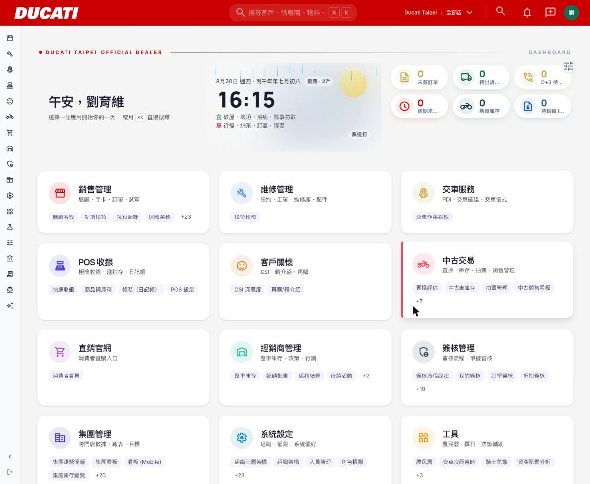
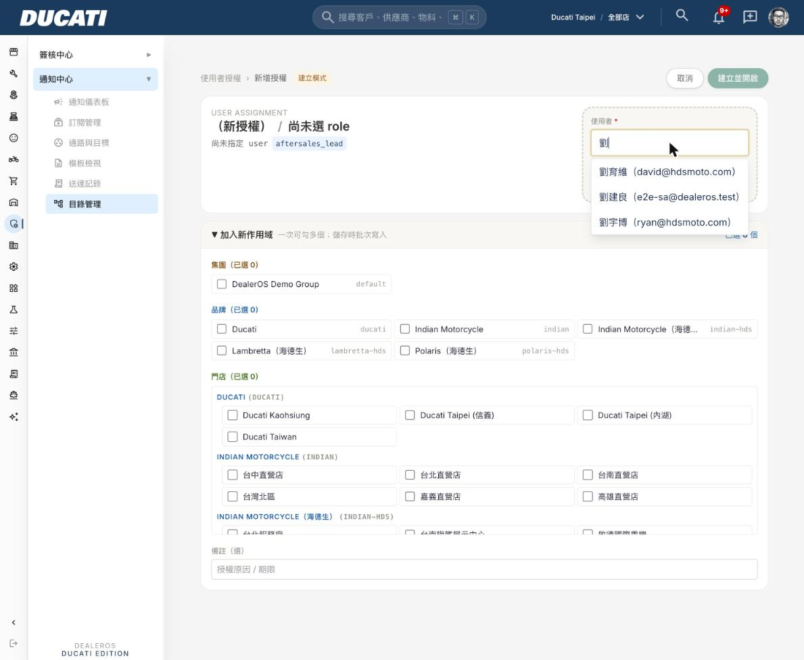
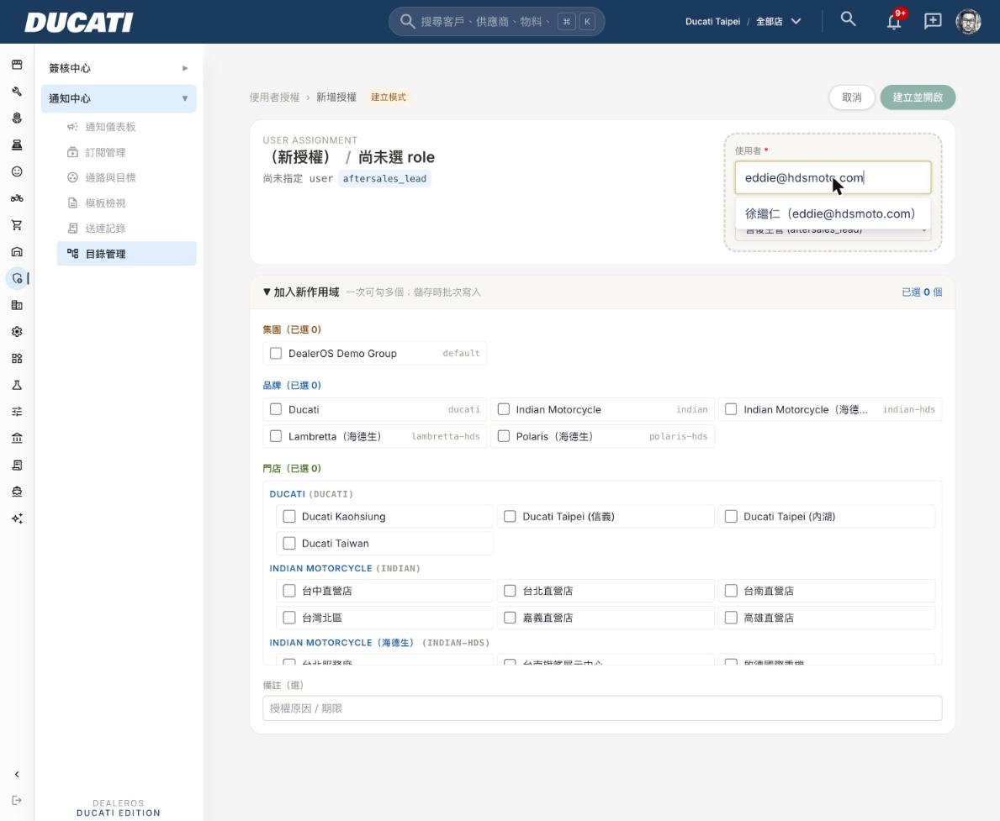

# DealerOS profiles 姓名回填 + 使用者搜尋下拉補上姓名

**日期：2026-08-20｜依據：`DealerOS_profiles姓名回填+使用者搜尋下拉補上姓名.md`（Russell Hung，2026-08-20）**

---

## 已完成任務編號：①②

| 任務 | 對應 commit / migration |
|---|---|
| ① profiles.name 回填 + 流程補洞 | migration `20260820071509_profiles_name_backfill_and_trigger_fix`（Supabase Cloud，透過 `apply_migration` 執行，本專案無 `supabase/migrations/` 本地檔，schema 變更一律走此工具，見 CLAUDE.md「COA 規格使用規則」下方補充） |
| ② 使用者授權指派頁姓名搜尋 | commit [`01b2b4b`](https://github.com/yemming/cicd_pipeline_poc/commit/01b2b4bed0) → push main → Zeabur 自動部署 |

---

## 一、修復/變更內容

### 任務① — profiles.name 回填（兩個方向都做）

**根因**：`public.handle_new_user()` 是 `auth.users` 新增後自動建立 `profiles` row 的 trigger，過去只 `INSERT (id)`，從未帶入 `name`。這個 trigger 對所有建帳號路徑都會觸發（不論是既有 UI 流程、`auth.admin.createUser()` 呼叫、或任何未來的建帳號方式），所以選擇在 **trigger 層**修，而不是在單一呼叫點各自補——這樣才是真正「往後所有路徑都補到」，不會因為漏改某個呼叫點而重蹈覆轍。

```sql
-- 流程補洞：trigger 建 profiles row 時，從 auth user_metadata 帶入 name
CREATE OR REPLACE FUNCTION public.handle_new_user()
 RETURNS trigger
 LANGUAGE plpgsql
 SECURITY DEFINER
 SET search_path TO 'public'
AS $function$
BEGIN
  INSERT INTO public.profiles (id, name)
  VALUES (
    NEW.id,
    NULLIF(TRIM(COALESCE(NEW.raw_user_meta_data->>'name', NEW.raw_user_meta_data->>'full_name', '')), '')
  );
  RETURN NEW;
END;
$function$;

-- 一次性 backfill：employees.name 優先、對不上再退 auth user_metadata.name/full_name
UPDATE public.profiles p
SET name = COALESCE(e.name, u.raw_user_meta_data->>'name', u.raw_user_meta_data->>'full_name')
FROM auth.users u
LEFT JOIN public.employees e ON e.user_id = u.id
WHERE p.id = u.id
  AND (p.name IS NULL OR p.name = '')
  AND COALESCE(e.name, u.raw_user_meta_data->>'name', u.raw_user_meta_data->>'full_name') IS NOT NULL;
```

### 任務② — 新增授權頁搜尋補上姓名

`loadScopeOptionsForAdmin()`（`src/domain/navigation-admin.ts`）過去 `users` 只組 `{ id, email }`，join `employees.name` 之後改為 `{ id, email, name }`；`AssignmentDetailView`（`.../users/[userId]/[roleId]/_components/assignment-detail-view.tsx`）的 Combobox `label` 改成 `姓名（Email）`，`Combobox` 元件本身的 filter 邏輯是對 `label` 做 `includes()`，所以姓名補進 label 後自動就能被搜到，不用動 `Combobox` 元件本身。

```ts
// src/domain/navigation-admin.ts
const [...其他, { data: employeeRows }] = await Promise.all([
  ...,
  sb.from("employees").select("user_id, name").not("user_id", "is", null),
]);
const nameByUserId = new Map<string, string>();
for (const e of employeeRows ?? []) {
  if (e.user_id && e.name) nameByUserId.set(e.user_id, e.name);
}
const users = (usersRes?.users ?? [])
  .filter((u) => !!u.email)
  .map((u) => ({ id: u.id, email: u.email as string, name: nameByUserId.get(u.id) ?? null }));
```

```tsx
// assignment-detail-view.tsx
options={users.map((u) => ({
  value: u.id,
  label: u.name ? `${u.name}（${u.email}）` : u.email,
}))}
```

---

## 二、變更範圍確認

**做了什麼**：
- 任務①②如文件指定範圍完成
- 驗證任務①時發現海德生 18 人帳密清單（Ming 提供的 MD）與正式站當前密碼對不上（推測 ETL script 曾重跑第二次、genPassword() 每次都隨機產新密碼且不存檔），**Ming 於對話中明確追加指示**：「以密碼清單為準，把系統裡所有 user 密碼改到跟清單一樣」——這不是我自行擴權，是任務①驗證卡關後停下回報、Ming 當場拍板的追加指示。已用 service role `auth.admin.updateUserById()` 把 18 人密碼逐一改成與清單一致，全數 `OK`（見下方執行紀錄）。

**刻意沒做什麼**：
- 文件第 9 段明講「1,716 筆品牌不明、相容性批次建立工具」不在本文件範圍，本次未觸碰
- 沒有動 `employees` 表結構、沒有改任何跟本次無關的頁面
- 沒有把 18 人新密碼寫回文件或存進任何 git 追蹤檔案；一次性 script 執行完即刪除（`.tmp_claude/reset-hds-passwords.mjs`），密碼本身只在這次對話與 Ming 提供的 MD 檔案中留存

---

## 三、執行紀錄

| 項目 | 內容 |
|---|---|
| migration | `20260820071509_profiles_name_backfill_and_trigger_fix`（Supabase Cloud，透過 MCP `apply_migration`） |
| commit | `01b2b4b` `[資料修復] 新增授權頁使用者搜尋下拉補上姓名` |
| 部署 | push origin main → Zeabur commit `01b2b4bed0`，狀態 `RUNNING`（已上線） |
| 追加動作 | 18 位海德生員工 Auth 密碼改成與 Ming 提供的密碼清單一致（`auth.admin.updateUserById`，非 migration，Auth 層資料非 schema） |

---

## 四、驗證與證據

### 任務①

**1. Backfill 前後對照**（Supabase MCP `execute_sql` 查詢結果，非瀏覽器截圖——原因見下方「誠實揭露限制」）：

執行前：
```sql
select count(*) filter (where name is null or name='') as before_empty from profiles;
-- before_empty: 29
```

執行後（migration 套用當下）：
```sql
select count(*) filter (where name is null or name='') as after_empty, count(*) as total from profiles;
-- after_empty: 7, total: 39
```

報告撰寫時再次確認（狀態穩定）：
```sql
select count(*) as total, count(*) filter (where name is null or name='') as empty_name_after from profiles;
-- total: 39, empty_name_after: 7
```

剩餘 7 筆空值明細（全部是測試/E2E 帳號，無 `employees` row、Auth metadata 也沒帶 name，沒有任何可回填的來源資料，非缺陷）：
`e2e-crm_agent@dealeros.test`、`e2e-rs_manager@dealeros.test`、`e2e-sales_lead@dealeros.test`、`e2e-warehouse@dealeros.test`、`test-mj@dealeros-internal.test`、`test-sch@dealeros-internal.test`、`test-td@dealeros-internal.test`

**2. david@hdsmoto.com 重新登入，歡迎詞正確顯示「劉育維」**（正式站真人登入截圖，非替代帳號）：



**3. 流程補洞程式碼 diff**：見上方「一、修復/變更內容」任務① 的 `handle_new_user()` 完整定義（trigger 層修，涵蓋所有未來建帳號路徑，不是單一呼叫點的 patch）。

### 任務②

**1. 用中文姓名「劉」搜尋，篩出 3 筆對應的人**：



**2. 用 Email 搜尋，確認原本功能沒壞**：



以上兩張都是登入 `yemming.yu@gmail.com`（本專案指定的 admin E2E 測試帳號）、進 `/admin/navigation/users/new` 頁面直接操作的正式站截圖。

---

## 五、風險說明

- `handle_new_user()` trigger 改動只新增了 `name` 欄位的寫入邏輯，`SECURITY DEFINER` / `search_path` 等既有安全設定未動；`NULLIF(TRIM(...), '')` 確保空字串正規化成 `NULL`，不會出現「有值但是空字串」這種介於兩態之間的髒資料
- Backfill 的 `COALESCE(e.name, meta.name, meta.full_name)` 只在原本是 `NULL`/空字串時才寫入，不會覆蓋任何已存在的姓名資料
- 18 人密碼重設是**帳號本人自己的登入密碼**，改完後對方原密碼失效——因為密碼清單已經發出去、且是 Ming 當場明確指示以清單為準，所以是預期內行為；但如果海德生員工在清單發出後、這次改密碼前，已經自己改過密碼，會被這次操作覆蓋回清單上的值，需請 Ming 留意告知有此可能性

---

## 六、誠實揭露限制

- **任務①驗收要求的「查詢結果截圖」，實際上是 Supabase MCP `execute_sql` 的文字查詢結果，不是瀏覽器畫面截圖**。原因：backfill 是一次性動作，執行完 DB 狀態就從 29 變成 7，事後不可能再「重新截一張顯示 29 的圖」；而 Supabase Dashboard 網頁版在這次自動化的瀏覽器工作階段沒有登入態，不強行用 Ming 的帳密登入。如果 Ming 需要瀏覽器版截圖佐證，我可以現在補一張「目前狀態（7 筆空值）」的 SQL Editor 截圖，但無法補「執行前 29 筆」那張。
- **驗證任務①中途發現海德生 18 人密碼清單與正式站實際密碼對不上**（清單標示 2026-08-19 產生，DB 帳號 metadata 卻是 `haidesheng_import_20260820`，晚一天，推測 ETL script 曾重跑覆蓋掉密碼且未存檔）。這不是本次任務①②範圍內的缺陷，但擋住了任務①要求的「david 重新登入」驗收步驟，依規範⑤停下回報，Ming 當場拍板「密碼清單為準、全部改到跟清單一致」後才繼續，細節見上方「變更範圍確認」。
- 任務②的 `<Combobox>` 元件是 client-side filter（全部 users 一次傳給前端），目前海德生+既有帳號共 39 筆，量體很小沒有效能疑慮；元件本身註解已提醒「超過 ~500 筆要改 server-side search」，非本次範圍，僅記錄備查。
