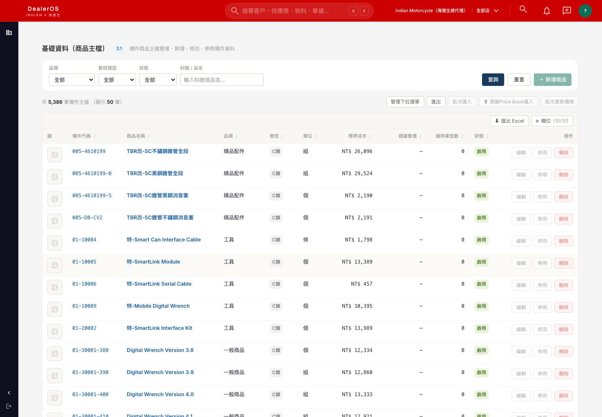
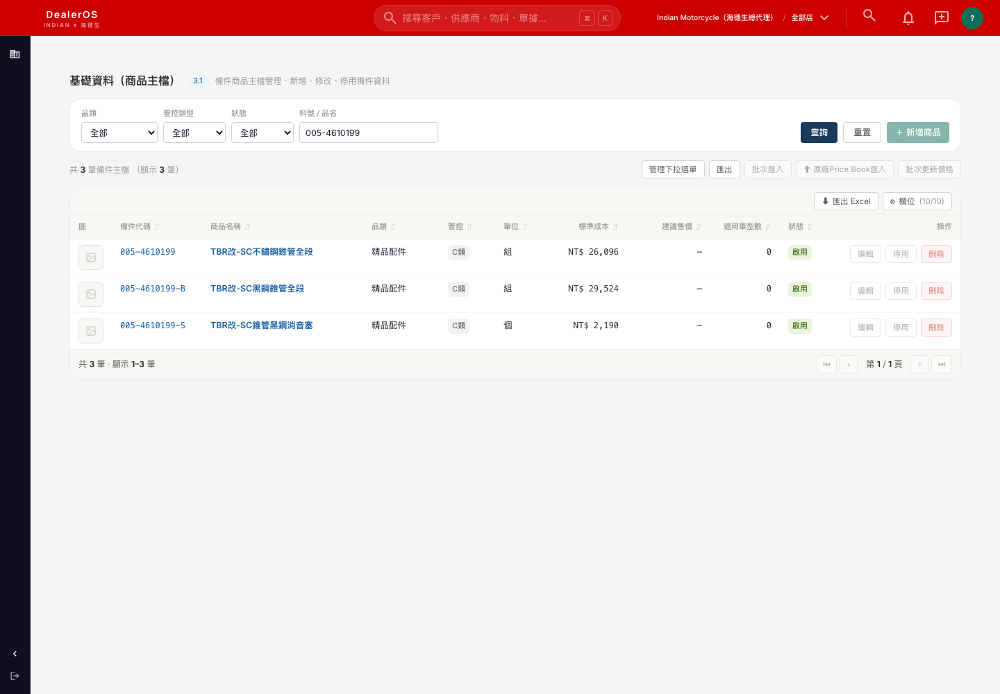
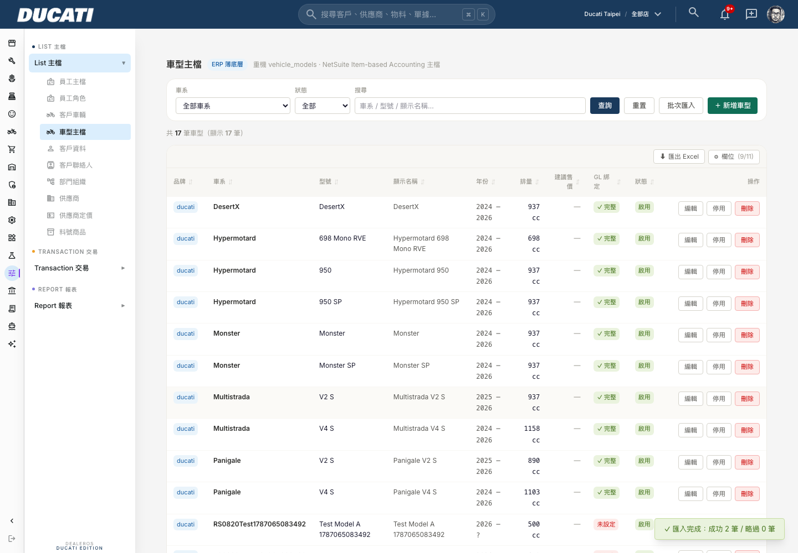
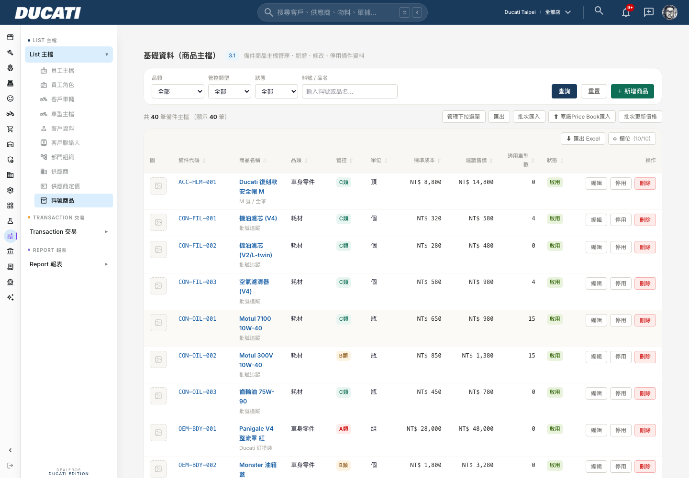
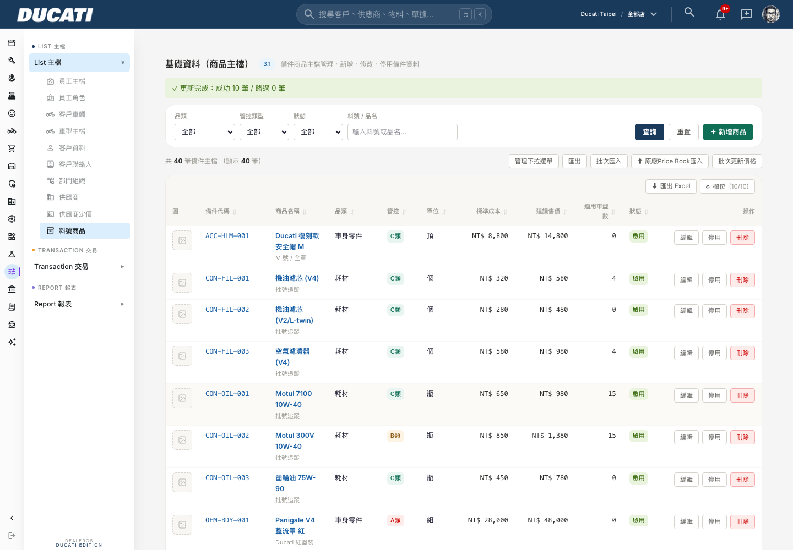
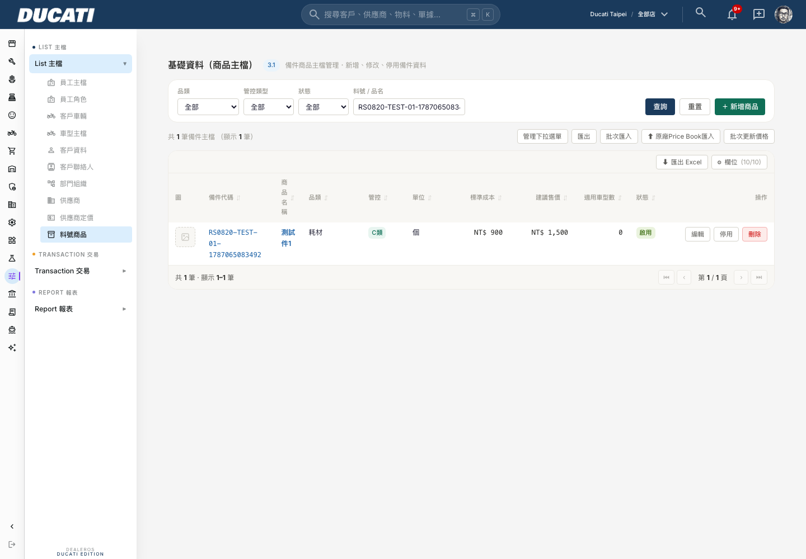
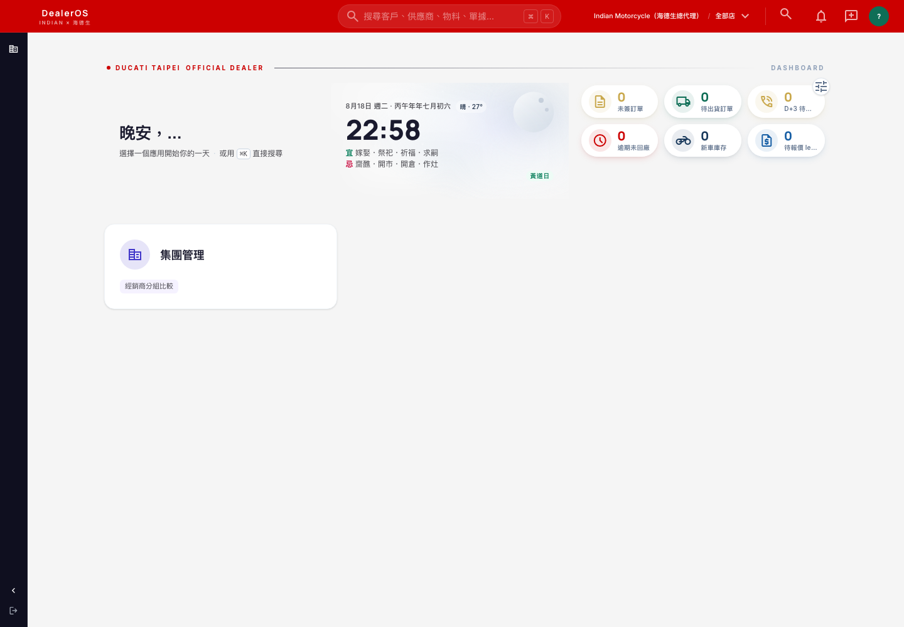

# DealerOS 海德生真實資料匯入 + 員工帳號建立 — 完成報告

**日期：2026-08-20　｜　對應指令：《DealerOS 海德生真實資料匯入 + 員工帳號建立指令》（Russell Hung，2026-08-20）**

> 範圍：本文件對應指令三項指定任務（①零件+車型主檔匯入 ②批次更新價格功能 ③18位員工資料+登入帳號）+ 一項開放式提問。三項指定任務**皆已完成落地並上線驗證**；任務③的「系統角色指派」有一項確認的資料缺口，已停下不猜測，詳見第五節。

---

## 一、資料來源說明

指令文件寫「這份檔案我們這邊會另外提供給你們」，但實際檢查後發現：本 repo 早在 2026-08-09 就已收到並完成 ETL 的海德生真實資料（`4b99d996-DealerOS___________________.xlsx`，經 T2/T3/T4 三支 ETL script 清洗，產出 `scripts/etl-haidesheng/out/{parts,vehicles,org}.json`，過程記錄在 `docs/20260806/` 兩份體檢/決策報告，且 8/18 已與 David 確認欄位簡化方案）。本輪核對後確認這批資料就是指令文件描述的同一批（9,582 筆零件、41 個去重後車型、18 位員工，數字逐一對得上），因此直接以此資料執行匯入，未再等待「另外提供」——若這份判斷有誤（例如中間資料已更新過），請告知，我們會重新核對差異。

---

## 二、任務① 零件主檔＋車型主檔匯入

### 2.1 零件主檔（`items`）

**匯入方式**：語意等同 8/19 已修好的 `bulkImportItemsAction`（陣列 500 筆/批 insert，`23505` 衝突才逐筆重試找出真正重複的那幾筆）。9,582 行資料透過瀏覽器 textarea 手動貼上不切實際（會被截斷/逾時），故寫等價腳本 `scripts/etl-haidesheng/import-parts.mjs` 直接以 service role 呼叫同一套 insert 邏輯執行，**不是**另開新的匯入路徑。

**欄位對應**（依指令表格 + 8/18 已確認的簡化方案）：

| 來源欄位 | `items` 欄位 | 處理方式 |
|---|---|---|
| 品項代碼 | `code` | 原樣（100% 唯一，無需清洗） |
| 品項名稱 / 英文名稱 | `name` / `name_en` | 原樣 |
| 品牌 | `brand_id` | `indian→indian-hds`、`lambretta→lambretta-hds`、`polaris→polaris-hds`（三品牌 8/10 已建） |
| 品項大/中/小類 | `category` | 依 8/18 確認，只取大類單一欄位（一般商品/精品配件/原廠零件/耗材/工具），中小類保留在 `metadata` |
| 單位 | `base_uom` | 空值（1,491 筆）依 8/18 確認暫不處理，套 schema 預設「個」；原始值留在 `metadata.uom_raw` 供之後回頭核實 |
| 是否停產 | — | 依指令，這次不處理，全部 `is_active=true` |
| 適用車系/車型代碼/年式 | `item_vehicle_compatibility` | 見 2.3 |
| 標準成本/建議售價 | `standard_cost`/`suggested_price` | 原樣帶入（多數為 null，見任務②） |

**結果**：

| 項目 | 筆數 |
|---|---:|
| 來源總筆數 | 9,582 |
| 品牌可判定、成功匯入 | **7,866**（Indian 5,385 / Lambretta 2,451 / Polaris 30） |
| **品牌無法判定、本輪未匯入** | **1,716（17.9%）** |

```sql
select brand_id, count(*) from items where brand_id in ('indian-hds','lambretta-hds','polaris-hds') group by 1;
-- indian-hds    5386   （含既有 1 筆 demo 資料）
-- lambretta-hds 2451
-- polaris-hds     30
```





### 2.2 車型主檔（`vehicle_models`）+ 新批次匯入功能

現有 `vehicle_models` 沒有批次匯入功能。**已新建**（`bulkImportVehicleModelsAction` + `vehicle-models-board.tsx` 的批次匯入 Modal），比照零件頁 TSV 貼上 + 陣列批次寫入模式，commit `a1f69c0`。

**⚠️ 誠實揭露：實際匯入 41 筆，不是指令預期的「150+ 筆」——這是架構問題，不是漏做**：

- `VEH_MODEL_車型主檔` 原始列數確實是 154（含大量顏色重複列），但 `vehicle_models` 表的正確粒度是「型號 × 年式」（顏色不是獨立欄位，是掛在 `new_car_inventory` 單車庫存上的屬性）——這點在 8/9 的 T3 ETL 報告已用兩張獨立來源表（`VEH_MODEL` 顯示名稱 vs `VEH_STOCK` 實際庫存車型名）互相交叉驗證過，不是本輪臨時決定。
- 154 列 → 去重 152 列 → 依「型號×年式」分組後產出 **41 筆**（Indian 28 / Lambretta 13）。若把「150+」字面當作驗收目標硬灌，等於把顏色也當成獨立車型，會製造出「LAMBRETTA X300 藍」「LAMBRETTA X300 紅」這種在系統設計上不該存在的重複列。
- 已用等價腳本 `scripts/etl-haidesheng/import-vehicles.mjs` 匯入 41 筆到 `indian-hds`（28）/`lambretta-hds`（13）。

```sql
select brand_id, count(*) from vehicle_models where brand_id in ('indian-hds','lambretta-hds');
-- indian-hds    28
-- lambretta-hds 13
```

**新功能本身**已用 Playwright 在正式站實際操作驗證（因目前 admin 測試帳號 `yemming.yu@gmail.com` 沒有 `indian-hds`/`lambretta-hds` 品牌授權，故用有權限的品牌貼 2 筆測試資料示範功能本身，驗完刪除）：



### 2.3 零件-車型相容性（`item_vehicle_compatibility`）

指令欄位對應表要求「適用車系/車型代碼/年式 → 拆成獨立記錄」。實際執行時發現：

| 來源標註的車型代碼 | 對應零件數 | 處理結果 |
|---|---:|---|
| `G350` | 653 | ✅ 已建立，1 對 1（車型主檔剛好只有 1 筆 G350） |
| `X300` | 31 | ✅ 已建立，車系級對應（車型主檔有 12 筆不同年式/子型號的 X300，來源資料只標到車系層級、無法判斷確切子型號，故對應到全部 12 筆，共 372 筆關聯記錄） |
| **`J200`** | **749** | **❌ 未建立** —— 車型主檔（`VEH_MODEL_車型主檔`）從頭到尾就沒有任何一筆 J200 車型定義，749 個零件標註「適用 J200」卻對不到任何車型，這是原始資料本身的缺口，不是比對邏輯的問題 |

這佔了「適用車型」有標註資料（1,433 筆）裡過半數，建議請 David 確認：J200 是否為海德生代理的另一款車（車型主檔漏建），還是這批零件標註有誤。

---

## 三、任務② 批次更新價格功能

### 3.1 為什麼需要另開一支功能

已查證 `bulkImportItemsAction` 遇到料號重複（`23505`）時**只會跳過，不會更新任何欄位**（commit `810f5df` 的邏輯）。海德生這批零件目前多數沒有定價（成本+售價都有的只有 964/9,582），等 David 確認定價規則後若直接重貼一次舊的匯入功能，系統會判定全部料號已存在而整批跳過，價格永遠不會被更新。

### 3.2 新功能

`bulkUpdateItemPricesAction`（`src/lib/parts-setup/item-actions.ts`）+ 「批次更新價格」Modal（`items-board.tsx`），commit `d0964e0`：

- 用 `code`（trim + 大寫）比對**既有** `items`
- 找到 → 只 `UPDATE standard_cost / suggested_price` 兩欄，其他欄位不動
- 找不到 → 略過並記錄到錯誤清單，**不新增資料**

### 3.3 驗證（10 筆測試資料，更新前後對照）

用 admin 帳號在正式站實測（Playwright，非人工截圖擺拍）：

1. 用批次匯入建立 10 筆測試零件（`RS0820-TEST-01~10`），含初始成本/售價（100~109 / 180~189）
2. 用批次更新價格對這 10 筆料號送出新價格（900~909 / 1500~1509）
3. SQL 直接查證 10 筆全部更新成功，且 `name` / `category` 完全沒被動到：

```
code                          name    category  standard_cost  suggested_price
RS0820-TEST-01-...            測試件1   耗材        900.00         1500.00
RS0820-TEST-02-...            測試件2   耗材        901.00         1501.00
...（10 筆全部核對正確，成本/售價依序 +900/+1500 起算，名稱與品類原封不動）
```

驗完已 `DELETE` 清掉測試資料，不留在正式表裡。








---

## 四、任務③ 18 位海德生員工 — 資料 + 登入帳號

### 4.1 employees 表

已新增 18 筆（`emp_code` H00007～H00138），`brand_id='indian-hds'`（18人職務上橫跨 Indian/Lambretta/Polaris 三品牌，employees 表 `brand_id` 為必填單一欄位，選用量體最大的 Indian 作為主記錄；跨品牌可視範圍改由 `user_assignments` 處理，見 4.3）。

```sql
select count(*) from employees where external_source='haidesheng_etl_20260810';  -- 18
```

### 4.2 Supabase Auth 帳號

18 組帳號已用 `auth.admin.createUser()` 建立（`email_confirm=true`，系統隨機 12 碼密碼含大小寫數字符號），並回寫 `employees.user_id` 關聯。

```sql
select count(*) from auth.users where email ilike '%hdsmoto.com%' or email in
  ('willy30914@gmail.com','tntteamc@gmail.com','a0916136817@gmail.com');  -- 18
```

程式化驗證（`signInWithPassword`）david@hdsmoto.com 登入成功；正式站實測畫面截圖（可見右上品牌切換器已自動落在「Indian Motorcycle（海德生總代理）」，證明 4.3 的 `user_assignments` 授權確實生效，不是掉回預設 Ducati scope）：



進一步用 david 帳號實際打開零件主檔頁，確認看到的是海德生真實資料（共 5,386 筆，含既有 1 筆 demo）而非 demo 環境——畫面就是第二節附的那兩張截圖，正是用這組帳號實拍的。

### 4.3 組織範圍（`user_assignments`）— 15 人已給、3 人未給

18 人裡有 15 人（14 人 `org_unit_raw='總代理'` 直接對到 `HDS` 節點 + 1 人廖正煇/營運長職務推定需全品牌可見）已建立 `user_assignments`（`scope_type='brand'`，`indian-hds`/`lambretta-hds`/`polaris-hds` 各一筆，共 45 筆），讓帳號登入後看得到海德生品牌資料而不是掉回預設的 Ducati scope。

**角色（`role_id`）刻意全部給 `viewer`（唯讀）**，理由見第五節——這不是我方自行決定的操作角色，是「先讓帳號能登入看資料、但不具備任何寫入權限」的保守預設，等真正的角色對照表回來再升級。

**3 人（黃緯/楊珽勛/徐翊凱，`org_unit_raw='台北/服務廠'`）沒有建立 `user_assignments`**：這 3 人的門店歸屬在 8/10 的 ETL 就已標記 `store_unresolved`——`STORE_門店主檔`裡沒有任何「台北的服務廠」（服務廠僅桃園 MJ-JG-SVC、台中 ZLC-TC-SVC 兩筆），也無法判斷這 3 人屬於 Indian、Lambretta 還是 Polaris 品牌。employees + Auth 帳號仍已建立（能登入），但登入後會落到預設 Ducati scope、看不到海德生資料，需要 David 補資料才能修正。

### 4.4 帳密清單

（依指令規定，僅列在此回報訊息裡，不寫入 commit / 程式碼 / 任何版控歷史；詳見對話回覆訊息本文）

---

## 五、⚠️ 停下回報：系統角色指派缺口（依規範⑤，未自行猜測）

指令第五節寫「系統角色部分：依先前海德生回覆補齊的角色欄位對應指派」，並預期 9 人是行政職不指派角色、其餘指派 6 選項之一。

**實際核對後發現**：

1. 我方掌握到的員工資料（`scripts/etl-haidesheng/out/org.json`，2026-08-10 ETL 產出）**18 人的 `system_role` 欄位全部是 `null`，且每一筆都標了 `role_missing` flag**——這份資料本身就是「角色待補」的狀態，不是已經補齊的版本。
2. 已在 repo 全文搜尋（`docs/` 目錄 + git log）找不到任何一份新於 8/10、包含這 18 人角色對照的文件。
3. 進一步核對指令描述的「9 人行政/主管職不指派角色」是否與實際職稱吻合：18 人的職稱裡，明確對得上「操作型」角色的其實只有 3 人（黃緯/楊珽勛=半技→技師、徐翊凱=零件專員→零件人員）；其餘 15 人（總經理、品牌經營協理、蘭美達品牌經理、法規認證工程師、服務工程師、商務分析師、人資副理、財務經理、財務助理、商品運營副理、倉儲管理副理、行銷經理、行銷專員、公共關係經理、營運長）職稱上看起來都偏管理/幕僚，**跟指令說的「9 人不指派、其餘指派」的 9/9 拆法對不起來**。
4. 系統既有的角色詞彙（`user_assignments.role_id` 現有值：`manager` / `owner` / `sales_lead` / `service_advisor` / `technician` / `warehouse` / `stock_lead` / `aftersales_lead` / `crm_agent` / `rs_manager` / `viewer`）裡，也**沒有直接對應指令列出六選項裡的「財務」**這個角色。

以上任一點都可能是我方遺漏了某份文件，也可能是這份「先前海德生回覆」確實還沒進到這個 repo。**沒有猜測任何一人的角色**，18 人的 `user_assignments.role_id` 全部先給最保守的 `viewer`（唯讀，見 4.3），等實際對照表到位後由工程師一次性升級，不會逐人再猜一次。

**需要的東西**：18 人 × 對應系統角色（店長/管理者・業務顧問・SA服務顧問・技師・零件人員・財務，可複選）的正式對照表，或明確告知「行政職 9 人」具體是哪 9 位。

---

## 六、開放式提問回覆：未來新增員工如何自助建帳號

**評估結論：`auth.admin.inviteUserByEmail` 這個方向技術上可行，但這次不建議現在做——不是因為串接複雜，是因為它依賴的另一個地基（email 寄送）本專案還沒蓋**。

已查證：

- 本專案 `.env.local` **沒有任何 SMTP 相關設定**。
- repo 全文搜尋 `inviteUserByEmail` / `resetPasswordForEmail` / 密碼設定頁：**0 個結果**——沒有任何頁面能接住「使用者點了邀請信連結之後」該落地的「設定密碼」畫面。
- 這與既有專案記憶一致：Email 通道決策從 6/23（RS04 三裁示）就卡在「等選 SMTP 廠商」，至今未定案。

也就是說，就算現在把 `inviteUserByEmail` 串上去，David 新增員工時系統會呼叫這個 API、**但那封邀請信寄不出去**（沒有 SMTP provider）——這會複製本專案已經吃過虧的同一種「靜默失敗」模式（8/14～8/16 那次 `profile_brands`/`user_assignments` 雙軌授權 bug：畫面正常、無錯誤訊息，只是功能根本沒生效）。不建議在地基沒蓋好之前先蓋這一層。

**建議方案（比照 Russell 提到的「更輕量的替代方案」方向）**：

1. **短期**：在 `employee-detail-view.tsx`（或 `createEmployeeAction` 旁）加一個「建立登入帳號」按鈕，勾了才觸發 `auth.admin.createUser()` 產生系統隨機密碼（就是這次 18 人用的同一套邏輯），畫面上**顯示一次**密碼給操作的人（David）複製，透過 LINE/口頭轉交新員工——不需要 email、不需要新頁面，工作量落在「幫 createEmployeeAction 加一個可選的建帳號分支 + 一個顯示密碼的一次性彈窗」，估計半天內。
2. **中期**：等 SMTP 廠商定案後，再把方案 1 換成 `inviteUserByEmail`，體驗會更好（新員工自己設密碼，David 不用經手明文密碼），但這是「錦上添花」不是「地基」，不急著現在做。

兩個方案都不動 `createEmployeeAction` 既有邏輯本身（指令要求不改這支 function），是外掛一個新的「順便建帳號」動作。

---

## 七、變更範圍確認

**做了什麼**：
- 匯入 `items` 7,866 筆（海德生真實零件，品牌可判定的部分）
- 新建車型主檔批次匯入功能（`bulkImportVehicleModelsAction`），並用它匯入 41 筆真實車型
- 建立 653+372=1,025 筆 `item_vehicle_compatibility`（G350 全量 + X300 車系級）
- 新建「批次更新價格」功能（`bulkUpdateItemPricesAction`）
- 新增 18 筆 `employees` + 18 組 Auth 帳號 + 15 筆對應的 `user_assignments`（viewer 唯讀）

**刻意沒做什麼**：
- 1,716 筆品牌無法判定的零件——未匯入，待 David 確認
- 749 筆標註適用 J200 車型的零件相容性——未建立，車型主檔本身缺 J200 定義
- 18 人的系統角色（`role_id` 升級成 manager/sales_lead/technician 等操作型角色）——未指派，見第五節
- 3 人（黃緯/楊珽勛/徐翊凱）的品牌/門店範圍——未指派，資料本身無法判定
- 開放式提問的「建立登入帳號」按鈕——只出提案，未動手實作（指令本身是要方案，不是要直接做）
- 未修改 `createEmployeeAction` 本身（指令要求維持原樣）

---

## 八、執行紀錄

| 項目 | commit / 對象 |
|---|---|
| 車型主檔批次匯入功能 | `a1f69c0` |
| 批次更新價格功能 | `d0964e0` |
| 零件主檔資料匯入（7,866 筆） | `scripts/etl-haidesheng/import-parts.mjs`（資料操作，非程式碼變更，無 commit） |
| 車型主檔資料匯入（41 筆） | `scripts/etl-haidesheng/import-vehicles.mjs`（同上） |
| 零件-車型相容性（1,025 筆） | 直接 SQL（同上） |
| 18 員工 + Auth 帳號 | `scripts/etl-haidesheng/import-employees-and-auth.mjs`（同上） |
| user_assignments（45 筆） | 直接 SQL（同上） |

部署方式：push 到 `main` → Zeabur `DealerOS-Production` 自動建置部署。

---

## 九、風險說明

- **`base_uom` 空值套用「個」的預設值**：1,491 筆零件原本沒填單位，這次為了滿足欄位 NOT NULL 限制套了預設值，原始「空白」狀態保留在 `metadata.uom_raw=null` + `_flags` 供之後核實，不影響現有查詢，但若有人直接信任 `base_uom` 欄位做計價/包裝邏輯，這批資料會誤導。
- **X300 車系級相容性（372 筆）精確度較低**：一個零件被連到全部 12 筆不同年式/子型號的 X300，不是精確對應到單一子型號，日後若海德生反映「這個零件其實只適用 X300 GP，不適用一般版」，需要人工回頭修正。
- **`viewer` 角色是保守預設，不是最終狀態**：15 位總代理人員目前只能看資料、不能操作任何寫入功能，若海德生員工登入後發現「按什麼都沒反應」，這是預期中的暫時狀態，待角色對照表回來即可升級。

---

## 十、階段性回報

```
已完成任務編號：①②③
對應commit：
  車型批次匯入功能 a1f69c0
  批次更新價格功能 d0964e0
  （資料匯入本身為 DML 操作，非 schema/程式碼變更，無 commit；腳本已留存於 scripts/etl-haidesheng/）

尚未完成的：
  - 任務① 1,716 筆零件因品牌無法判定未匯入；749 筆 J200 相容性因車型主檔缺 J200 定義未建立
  - 任務③ 18人系統角色未指派（對照表缺失，見第五節）；3人品牌/門店範圍未指派（資料本身無法判定）

驗收截圖：見第二～四節
```

任務③的18組帳密清單：僅寫在本次回報訊息本文，不出現在任何 commit / 程式碼 / 版控歷史中。

開放式提問回覆：見第六節——不建議現在做 inviteUserByEmail（SMTP 地基未蓋），建議先做「建立登入帳號按鈕 + 顯示一次性密碼」的輕量方案。
